Group Member: Kelly Zhang, Rui Ying, He Wang
============================================

Visual story telling part 1: green buildings
--------------------------------------------

Step1: Filter out the builidng with leasing rate less than 10%

    library(tidyverse)

    ## -- Attaching packages ------------------------------------------------------------------------ tidyverse 1.2.1 --

    ## v ggplot2 3.2.0     v purrr   0.3.2
    ## v tibble  2.1.3     v dplyr   0.8.3
    ## v tidyr   0.8.3     v stringr 1.4.0
    ## v readr   1.3.1     v forcats 0.4.0

    ## -- Conflicts --------------------------------------------------------------------------- tidyverse_conflicts() --
    ## x dplyr::filter() masks stats::filter()
    ## x dplyr::lag()    masks stats::lag()

    library(ggplot2)
    df_greenbuildings <- read.csv("greenbuildings.csv")
    df_greenbuildings <- df_greenbuildings[(df_greenbuildings$leasing_rate > 10),]

Step2: Plot size versus rent to see if the rent affect by size. The
scatter plot shows that as the the size increase, the rent increases as
well.

    ggplot(data = df_greenbuildings) + geom_point(aes(x=size, y=Rent, color = factor(green_rating))) +theme_bw()

Step3: Filter the data by size. Since the building we plan to build is
250,000 square feet, buildings with size between 200,000 to 300,000
square feet are good approximations for our analysis. A boxplot is then
created to show the distribution of rent for buildings with size between
200,000 to 300,000 square feet and surprisingly the non-green actually
slightly outperforms green buildings in rent price for size from 200000
to 250000.

    df_greenbuildings <-df_greenbuildings[df_greenbuildings$size > 200000 & df_greenbuildings$size < 300000,]

    df <- df_greenbuildings %>% mutate(sizecut = cut(size, c(200000,250000, 300000)))
    ggplot(data= df) + geom_boxplot(aes(x = sizecut, y = Rent,fill=factor(df$green_rating))) +theme_bw()

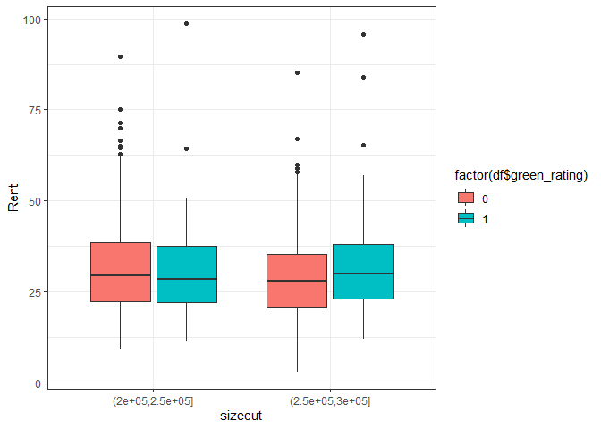

Step4: To see how the age of building affects the rent, age(continous)
variable is converted into 6 categories for plotting boxplots. The
result shows that green-certified buildings have lower average rent than
those non-green buildings, given the condition that we as an investor
only cares about the return for 30 years. The average rent for green
buildings exceeds non-green buildings only after 30 years.

    df_greenbuildings <- df_greenbuildings %>% mutate(agecut = cut(age, c(-1,15,30,60,90,150, 250)))
    ggplot(data= df_greenbuildings) + geom_boxplot(aes(x = agecut, y = df$Rent,fill=factor(green_rating))) +theme_bw()

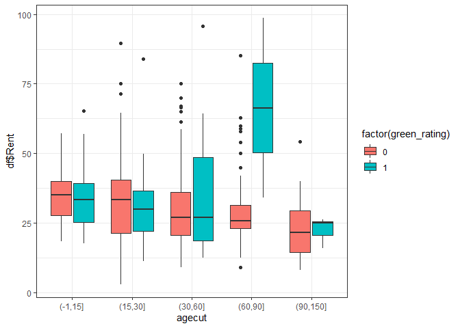

Step5: By plotting the stories verusu rent, we see a clear trend of
increase in rent as the number of stories increase

    ggplot(data = df_greenbuildings) + geom_point(aes(x=stories, y=Rent, color = factor(green_rating)))

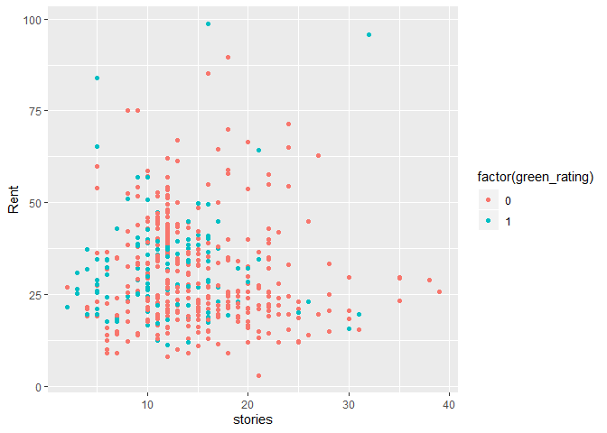

Step6: Since we only care about the rent for the buildings that are
similar to the one we are investing, the average rent for the buildings
with 10-20 stories is higher for non-green versus green

    df1<- df_greenbuildings%>%mutate(storiescut = cut(stories, c(0,10,20,30,40)))
    ggplot(data = df1) + geom_boxplot(aes(x= storiescut, y=Rent, fill = factor(green_rating)))+ theme_bw()

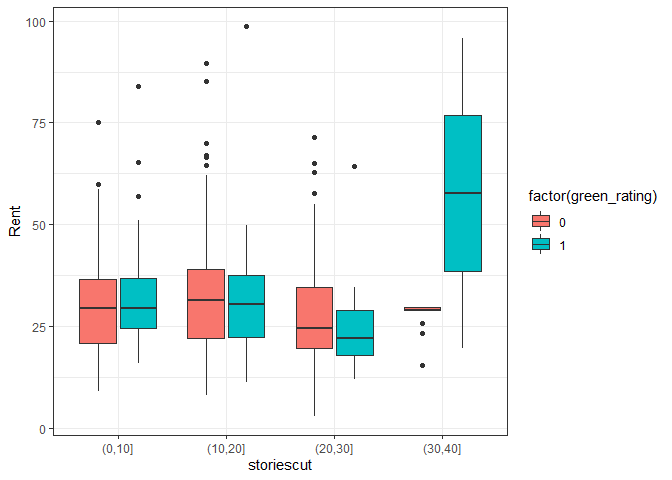

Step7: Combine the effect of age and stories variable by filter out the
buildings with age greater than 30 and stories less than 10 and greater
than 20.

    df_greenbuildings <- df_greenbuildings[df_greenbuildings$age >-1 & df_greenbuildings$age<30,]
    df_greenbuildings <- df_greenbuildings[df_greenbuildings$stories >10 & df_greenbuildings$stories<20,]

Step8: The fianl average of leasing rate for green buildings is
87.12074%, while the leasing rate for non-green buildings is 90.22357%.
However, the rent is much higher for non-green buildings after counting
the effect of size, age and stories, which is 35.39262 and for green
building is 30.77000.

Revenue = Building size(250,000) \* Leasing Rate \* Rent Per Square Feet
Expense for Non-green is 100 million, and for green is 105 million Thus,
the gross profit for non-green buildings is much higher than green
buildings. Has that been said, we do not support to invest in green
building.

    df_profit <- df_greenbuildings%>%group_by(green_rating)%>%summarise(avg_leasing_rate = mean(leasing_rate), avg_rent = mean(Rent))
    df_profit %>% mutate(Revenue = 250000 * avg_leasing_rate / 100 * avg_rent, Expense = c(1000000, 1050000))%>% mutate(gross_profit = Revenue - Expense)

    ## # A tibble: 2 x 6
    ##   green_rating avg_leasing_rate avg_rent  Revenue Expense gross_profit
    ##          <int>            <dbl>    <dbl>    <dbl>   <dbl>        <dbl>
    ## 1            0             87.1     35.4 7708579. 1000000     6708579.
    ## 2            1             90.2     30.8 6940448. 1050000     5890448.

Visual story telling part 2: flights at ABIA
--------------------------------------------

    library(ggplot2)

    #read the file and changed few variable into categorical variable
    airline = read.csv('ABIA.csv',header = TRUE)
    airline$Month = as.factor(airline$Month)
    airline$DayofMonth = as.factor(airline$DayofMonth)
    airline$DayOfWeek = as.factor(airline$DayOfWeek)
    #Filter the data of flights that departure from Austin 
    From = airline[airline$Origin == 'AUS',]

Overall we can see the volume of the flights from Austin to other city
went down towards the end of the years.

    # Trun delay into categorical variable 
    From$delay = ifelse(From$ArrDelay >=1,0,1)
    From$delay = as.factor(From$delay)

    #groupby month and count the number of flights per month
    From_count = From %>% 
      group_by(Month) %>%  
      summarize(flight_count=n())
    # plot the graph
    ggplot(From_count)+
      geom_bar(stat = 'identity',aes(x = Month, y = flight_count))+
      ggtitle("Flight volume per month")+theme(plot.title = element_text(hjust = 0.5))

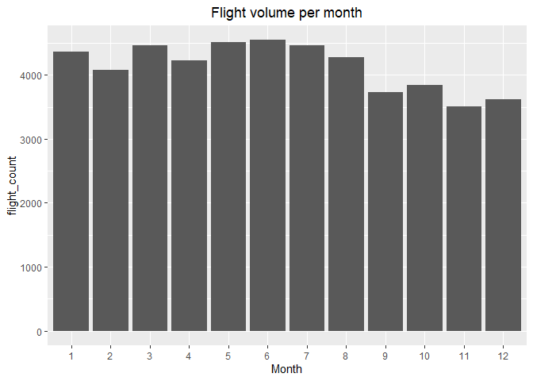

Looking into it further we can see that even though June has the most
flight volume, June has the lowest delay count. On the other hand
September to November has the highest delay rate despite the fact that
the flight volume are on the lower side.

    #grouped data by month and delays and count the delays in each month
    From_dely = From %>%
      group_by(Month,delay)%>%
      summarise(delay_count=n())

    ## Warning: Factor `delay` contains implicit NA, consider using
    ## `forcats::fct_explicit_na`

    #merged the delay count per month with the total flight counts
    From_merge = merge(From_dely,From_count,by='Month')
    From_merge = na.omit(From_merge)
    #plot the percentafe of delat vs. ontime
    ggplot(From_merge)+
      geom_bar(stat = 'identity',aes(x = Month, y = delay_count/flight_count, fill = factor(delay)))+
      ggtitle("Trend in delays per month(%)")+theme(plot.title = element_text(hjust = 0.5))

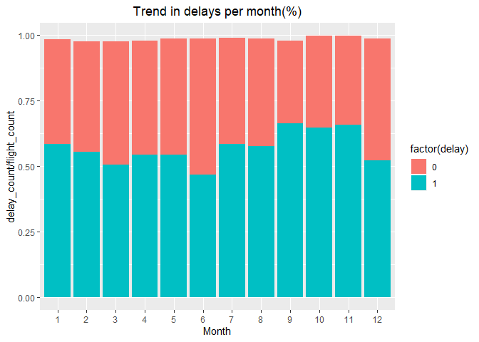

Now lets look in to what time was the worst to fly out. We can see
Morning from 6-9am is when most of the delay happen followed by
afternoon 12-3pm and before noon 9-12am and evening 3-6pm.

    #Grouped time into 7 time frame
    From$time_frame = NA
    From$time_frame[From$CRSDepTime > 600] = "EarlyMorning"
    From$time_frame[From$CRSDepTime > 600 & From$CRSDepTime <= 900] = "Morning"
    From$time_frame[From$CRSDepTime > 900 & From$CRSDepTime <= 1200] = "BeforeNoon"
    From$time_frame[From$CRSDepTime > 1200 & From$CRSDepTime <= 1500] = "Afternoon"
    From$time_frame[From$CRSDepTime > 1500 & From$CRSDepTime <= 1800] = "Evening"
    From$time_frame[From$CRSDepTime > 1800 & From$CRSDepTime <= 2100] = "Night"
    From$time_frame[From$CRSDepTime > 2100 & From$CRSDepTime <= 2359] = "LateNight"
    #group by delays and time frame and get the count in each variable
    sum_time = From %>%
      group_by(delay,time_frame)%>%
      summarise( time_count= n())

    ## Warning: Factor `delay` contains implicit NA, consider using
    ## `forcats::fct_explicit_na`

    sum_time= na.omit(sum_time)
    #plot the graph
    ggplot(sum_time)+
      geom_bar(stat = 'identity',aes(x = time_frame, y = time_count,fill = factor(delay)),position = 'dodge')+
      ggtitle("Trend in delays on time of the day")+theme(plot.title = element_text(hjust = 0.5))

Now lets look at the average time of day in each time of the day. We see
that the longest delays happens in the evening and the shortest happens
in late night. If you leave on evning there are about 50% of chance that
the flight delays for about 60 minutes.

    # grouped by time frame and calculated average time 
    sum_time1 = na.omit(From) %>%
      group_by(time_frame)%>%
      summarise( time_mean = mean(ArrDelay),n= n())
    ggplot(sum_time1)+
      geom_bar(stat = 'identity',aes(x = time_frame, y = time_mean))+
      ggtitle("Average time of Delay (Time of the Day)")+theme(plot.title = element_text(hjust = 0.5))

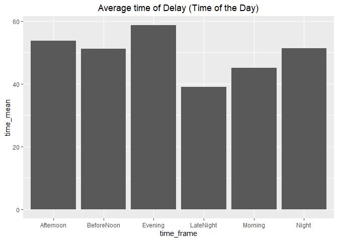

Now lets see which day has the worst. Overall either one of the day
there are more probablity of delay than on time. However the worst day
to go is saturday.

    # changed dat of week in to words
    From$name = NA
    From$name[From$DayOfWeek == 1] = 'Monday'
    From$name[From$DayOfWeek == 2] = 'Tuesday'
    From$name[From$DayOfWeek == 3] = 'Wednesday'
    From$name[From$DayOfWeek == 4] = 'Thursday'
    From$name[From$DayOfWeek == 5] = 'Firday'
    From$name[From$DayOfWeek == 6] = 'Saturday'
    From$name[From$DayOfWeek == 7] = 'Sunday'

    #grouped by name and delay and count the delay for each day
    sum_day = From %>%
      group_by(name,delay)%>%
      summarise(Day_count = n())

    ## Warning: Factor `delay` contains implicit NA, consider using
    ## `forcats::fct_explicit_na`

    sum_day = na.omit(sum_day)
    #plot the graph
    ggplot(sum_day)+
      geom_bar(stat = 'identity',aes(x = name, y = Day_count,fill = factor(delay)),position = 'dodge')+
      ggtitle("Delays in Day of the Week")+theme(plot.title = element_text(hjust = 0.5))

The average time of delays seems pretty even among different days of the
week

    #grouped by names and calculated average time 
    sum_day1 = na.omit(From) %>%
      group_by(name)%>%
      summarise(Day_mean=mean(ArrDelay),n = n())

    ggplot(sum_day1)+
      geom_bar(stat = 'identity',aes(x = name, y = Day_mean))+
      ggtitle("Average time of delays in Day of the Week")+theme(plot.title = element_text(hjust = 0.5))

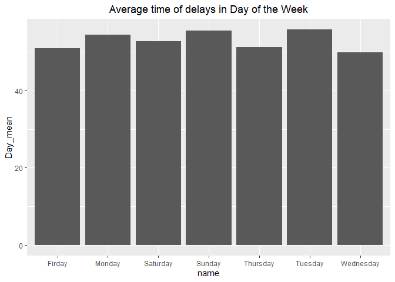

From the plot we can see WN has most the flights but also have a pretty
high delay rate. OH is the only carrier that has a higher on time rate
than delay rate, but they also have a very small number of flights. Time
wise US has the lowest average delay time, OH and F9 has some what lower
average. Other carrier seems to be somewhat similar in terms of delay
time.

    sum_car = From %>%
      group_by(UniqueCarrier,delay)%>%
      summarise(car_count = n())

    ## Warning: Factor `delay` contains implicit NA, consider using
    ## `forcats::fct_explicit_na`

    sum_car = na.omit(sum_car)

    ggplot(sum_car)+
      geom_bar(stat = 'identity',aes(x = UniqueCarrier, y = car_count,fill = factor(delay)),position = 'dodge' )+
      ggtitle("Delay in each Carrier")+theme(plot.title = element_text(hjust = 0.5))

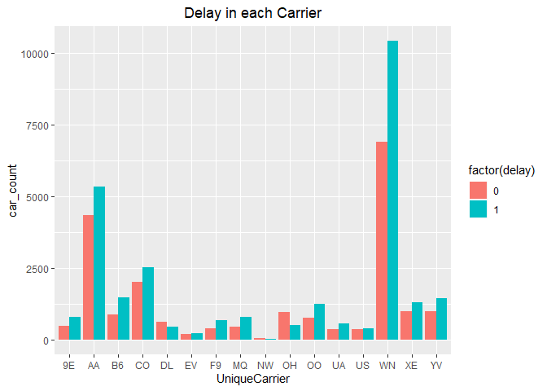

    sum_car1 = na.omit(From) %>%
      group_by(UniqueCarrier)%>%
      summarise(car_mean=mean(ArrDelay),n = n())

    ggplot(sum_car1)+
      geom_bar(stat = 'identity',aes(x = UniqueCarrier , y = car_mean))+
      ggtitle("Average Delay in each Carrier")+theme(plot.title = element_text(hjust = 0.5))

    df1<- From[(From$CarrierDelay == 1),] 
    df1 = na.omit(df1)
    df1_1 = df1%>%mutate(delay_reason = "CarrierDelay")

    df2<-From[(From$WeatherDelay == 1),] 
    df2 = na.omit(df2)
    df2_2 <- df2%>%mutate(delay_reason = "WeatherDelay")

    df3<-From[(From$NASDelay == 1),] 
    df3 = na.omit(df3)
    df3_3 = df3%>%mutate(delay_reason = "NASDelay")

    df4<-From[(From$SecurityDelay == 1),] 
    df4 = na.omit(df4)
    df4_4 = df4%>%mutate(delay_reason = "SecurityDelay")

    df5<-From[(From$SecurityDelay == 1),] 
    df5 = na.omit(df5)
    df5_5 = df5%>%mutate(delay_reason = "LateAircraftDelay")

    df <- rbind(df1_1,df2_2,df3_3,df4_4,df5_5)

From the heatmap we can see, after taking out the early departure time,
that evening is worst time to fly in terms of average time on delay.

    h1 = From[,c("time_frame","DayOfWeek","ArrDelay")]
    h1 = h1[h1['ArrDelay']>=0,]
    h1 = h1%>% group_by(DayOfWeek,time_frame)%>%summarise(delay_mean = mean(ArrDelay),n=n())

    ## Warning: Factor `DayOfWeek` contains implicit NA, consider using
    ## `forcats::fct_explicit_na`

    h1 = na.omit(h1)
    ggplot(h1, aes(DayOfWeek, time_frame)) + geom_tile(aes(fill = delay_mean), colour = "white") + scale_fill_gradient(low = "white",high = "steelblue")

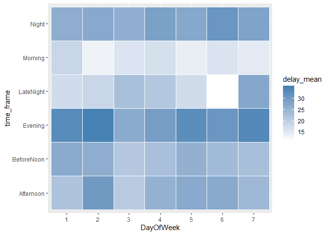

If you can avoid NW on Wednesday, it also shows that a lot of carriers
tends to have longer delays over the weekends.

    h2 = From[,c("UniqueCarrier","DayOfWeek","ArrDelay")]
    h2 = h2[h2['ArrDelay']>=0,]
    h2 = h2%>% group_by(DayOfWeek,UniqueCarrier)%>%summarise(delay_mean = mean(ArrDelay),n=n())

    ## Warning: Factor `DayOfWeek` contains implicit NA, consider using
    ## `forcats::fct_explicit_na`

    ## Warning: Factor `UniqueCarrier` contains implicit NA, consider using
    ## `forcats::fct_explicit_na`

    h2 = na.omit(h2)
    ggplot(h2, aes(DayOfWeek, UniqueCarrier)) + geom_tile(aes(fill = delay_mean), colour = "white") + scale_fill_gradient(low = "white",high = "steelblue")

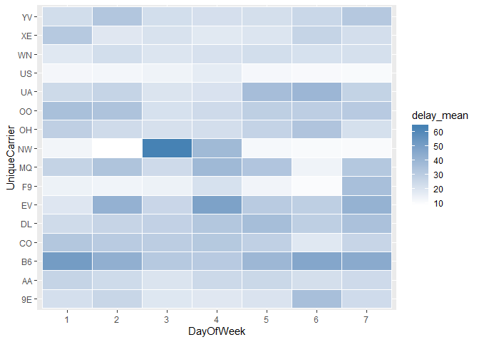

As expected December have longer delays especailly on saturdays.
Surprisingly, despite the fact that September to Novenmber has the most
delays, the average delay time was the shortest.

    h3 = From[,c("Month","DayOfWeek","ArrDelay")]
    h3 = h3[h3['ArrDelay']>=0,]
    h3 = h3%>% group_by(DayOfWeek,Month)%>%summarise(delay_mean = mean(ArrDelay),n=n())

    ## Warning: Factor `DayOfWeek` contains implicit NA, consider using
    ## `forcats::fct_explicit_na`

    ## Warning: Factor `Month` contains implicit NA, consider using
    ## `forcats::fct_explicit_na`

    h3 = na.omit(h3)
    ggplot(h3, aes(Month,DayOfWeek)) + geom_tile(aes(fill = delay_mean), colour = "white") + scale_fill_gradient(low = "white",high = "steelblue")

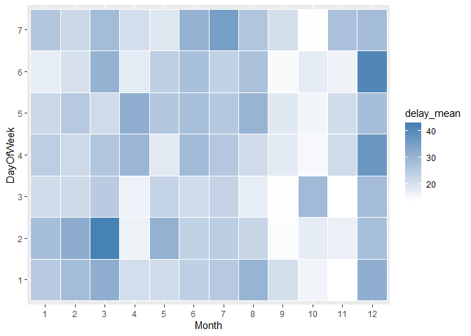

From the calender we can see December is where most of longer delay
happens, maybe due to more people travel on the holidays. We see a
particularly long delay on march the 18th so we looked up the date and
see anything happened that day, it turns out that to be the last day of
the SXSW. Understandably, since people come in different days but might
all leave on the same day cuasing a lot of traffic.

    h4 = From[,c("Month","DayofMonth","ArrDelay")]
    h4 = h4[h4['ArrDelay']>0,]
    h4 = h4 %>% group_by(Month,DayofMonth)%>% summarise(day1_mean = mean(ArrDelay),n=n())

    ## Warning: Factor `Month` contains implicit NA, consider using
    ## `forcats::fct_explicit_na`

    ## Warning: Factor `DayofMonth` contains implicit NA, consider using
    ## `forcats::fct_explicit_na`

    h4 = na.omit(h4)
    ggplot(h4, aes(Month,DayofMonth)) + geom_tile(aes(fill = day1_mean), colour = "white") + scale_fill_gradient(low = "white",high = "steelblue")

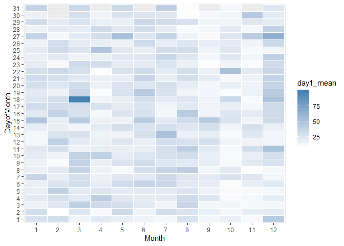

Lastly we can plotted the reason of delays in each month, since a lot of
data were missing, most of the cause was carrier delays and NASDelays.

    h5 = df[,c("Month","delay_reason")]
    h5 = h5 %>% group_by(Month,delay_reason)%>% summarise(n=n())
    h5 = na.omit(h5)
    ggplot(h5) + geom_bar(stat = 'identity', mapping = aes(x=Month,y=n,fill = delay_reason),position = 'dodge')

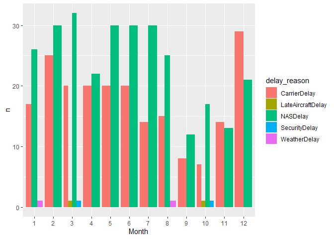

Conclusion: next time when you want to book for a flight, you can refer
to these information to aviod delays or at least choose a time of
shorter delay time.

Portfolio modeling
------------------

Step1: In order to set up ETFs portfolios and analyze short-term tail
risk, we choose three different portfolios with different industries.
For the first portfolio which is pretty diverse, it is included ETFs
from 3 industries: Agricultural commodity, Metals and Healthcare, and
ETFs from 2 different supporters: government and corporate.

    library(quantmod)

    ## Loading required package: xts

    ## Loading required package: zoo

    ## 
    ## Attaching package: 'zoo'

    ## The following objects are masked from 'package:base':
    ## 
    ##     as.Date, as.Date.numeric

    ## Registered S3 method overwritten by 'xts':
    ##   method     from
    ##   as.zoo.xts zoo

    ## 
    ## Attaching package: 'xts'

    ## The following objects are masked from 'package:dplyr':
    ## 
    ##     first, last

    ## Loading required package: TTR

    ## Registered S3 method overwritten by 'quantmod':
    ##   method            from
    ##   as.zoo.data.frame zoo

    ## Version 0.4-0 included new data defaults. See ?getSymbols.

    library(mosaic)

    ## Loading required package: lattice

    ## Loading required package: ggformula

    ## Loading required package: ggstance

    ## 
    ## Attaching package: 'ggstance'

    ## The following objects are masked from 'package:ggplot2':
    ## 
    ##     geom_errorbarh, GeomErrorbarh

    ## 
    ## New to ggformula?  Try the tutorials: 
    ##  learnr::run_tutorial("introduction", package = "ggformula")
    ##  learnr::run_tutorial("refining", package = "ggformula")

    ## Loading required package: mosaicData

    ## Loading required package: Matrix

    ## 
    ## Attaching package: 'Matrix'

    ## The following object is masked from 'package:tidyr':
    ## 
    ##     expand

    ## Registered S3 method overwritten by 'mosaic':
    ##   method                           from   
    ##   fortify.SpatialPolygonsDataFrame ggplot2

    ## 
    ## The 'mosaic' package masks several functions from core packages in order to add 
    ## additional features.  The original behavior of these functions should not be affected by this.
    ## 
    ## Note: If you use the Matrix package, be sure to load it BEFORE loading mosaic.

    ## 
    ## Attaching package: 'mosaic'

    ## The following object is masked from 'package:Matrix':
    ## 
    ##     mean

    ## The following objects are masked from 'package:dplyr':
    ## 
    ##     count, do, tally

    ## The following object is masked from 'package:purrr':
    ## 
    ##     cross

    ## The following object is masked from 'package:ggplot2':
    ## 
    ##     stat

    ## The following objects are masked from 'package:stats':
    ## 
    ##     binom.test, cor, cor.test, cov, fivenum, IQR, median,
    ##     prop.test, quantile, sd, t.test, var

    ## The following objects are masked from 'package:base':
    ## 
    ##     max, mean, min, prod, range, sample, sum

    library(foreach)

    ## 
    ## Attaching package: 'foreach'

    ## The following objects are masked from 'package:purrr':
    ## 
    ##     accumulate, when

    library(tidyverse)
    # Import ETF from different industries and different functions
    # Agriculture, metal, healthcare, government, corporate
    # pretty safe
    set.seed(9)
    portfolio_1 = c("LQD", "TAGS", "DBB","SHV","IHI")
    getSymbols(portfolio_1, from = "2015-01-01") 

    ## 'getSymbols' currently uses auto.assign=TRUE by default, but will
    ## use auto.assign=FALSE in 0.5-0. You will still be able to use
    ## 'loadSymbols' to automatically load data. getOption("getSymbols.env")
    ## and getOption("getSymbols.auto.assign") will still be checked for
    ## alternate defaults.
    ## 
    ## This message is shown once per session and may be disabled by setting 
    ## options("getSymbols.warning4.0"=FALSE). See ?getSymbols for details.

    ## [1] "LQD"  "TAGS" "DBB"  "SHV"  "IHI"

    # Adjust for splits and dividends
    LQDa = adjustOHLC(LQD)
    TAGSa = adjustOHLC(TAGS)
    DBBa = adjustOHLC(DBB)
    SHVa = adjustOHLC(SHV)
    IHIa = adjustOHLC(IHI)
    # Look at close-to-close changes
    plot(ClCl(DBBa))
    title('Close-to-Close Changes for DBB')

    set.seed(9)
    # Combine close to close changes in a single matrix
    all_returns_1 = cbind(ClCl(LQDa),ClCl(TAGSa),ClCl(DBBa),ClCl(SHVa),ClCl(IHIa))
    head(all_returns_1)

    ##               ClCl.LQDa   ClCl.TAGSa    ClCl.DBBa    ClCl.SHVa
    ## 2015-01-02           NA           NA           NA           NA
    ## 2015-01-05  0.004089110 -0.092284390 -0.010050251 0.000000e+00
    ## 2015-01-06  0.004072457 -0.068000033 -0.010786802 9.067404e-05
    ## 2015-01-07  0.001324419  0.002861302 -0.003207184 0.000000e+00
    ## 2015-01-08 -0.003223932  0.011055599  0.010296010 0.000000e+00
    ## 2015-01-09  0.002653840  0.000000000 -0.008280255 9.072932e-05
    ##               ClCl.IHIa
    ## 2015-01-02           NA
    ## 2015-01-05 -0.002477648
    ## 2015-01-06 -0.005056320
    ## 2015-01-07  0.018009949
    ## 2015-01-08  0.018567201
    ## 2015-01-09 -0.007308736

    all_returns_1 = as.matrix(na.omit(all_returns_1))
    N = nrow(all_returns_1)

    pairs(all_returns_1)
    title('Correlationship between ETFs in portfolio 1',line=5)

    # Look at the portfolio_1 returns over time
    plot(all_returns_1[,5], type='l')

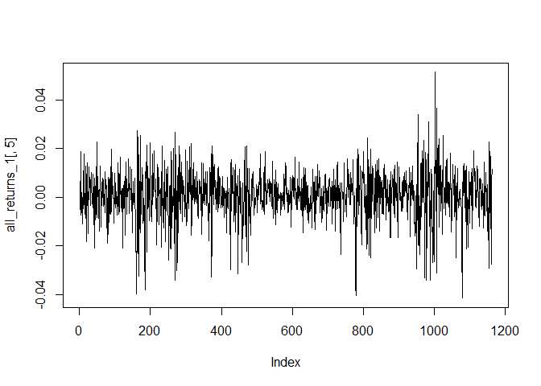

    # are today's returns correlated with tomorrow's? 
    # See today's return and tomorrow's for one ETFs  
    plot(all_returns_1[1:(N-1),5], all_returns_1[2:N,5])
    title("Today's return vs Tomorrow's return for IHI",line=5)

    for(ticker in portfolio_1) {
        expr = paste0(ticker, "a = adjustOHLC(", ticker, ")")
        eval(parse(text=expr))
    }

    head(LQDa)

    ##            LQD.Open LQD.High  LQD.Low LQD.Close LQD.Volume LQD.Adjusted
    ## 2015-01-02 102.4555 103.0037 102.4126  102.6525    2523600     102.6525
    ## 2015-01-05 102.9609 103.3806 102.8752  103.0723    3218800     103.0723
    ## 2015-01-06 103.3550 103.8004 103.2008  103.4920    5313400     103.4920
    ## 2015-01-07 103.3464 103.6976 103.2350  103.6291    1636600     103.6291
    ## 2015-01-08 103.3550 103.3721 103.1151  103.2950    2156900     103.2950
    ## 2015-01-09 103.1579 103.6719 103.1322  103.5691    1530400     103.5691

    # Sample a random return from the empirical joint distribution
    # This simulates a random day
    set.seed(9)
    return.today = resample(all_returns_1, 1, orig.ids=FALSE)
    initial_wealth = 100000
    sim1 = foreach(i=1:50, .combine='rbind') %do% {
        total_wealth = initial_wealth
        weights = c(0.2, 0.2, 0.2, 0.2, 0.2)
        holdings = weights * total_wealth
        n_days = 20
        wealthtracker = rep(0, n_days)
        for(today in 1:n_days) {
            return.today = resample(all_returns_1, 1, orig.ids=FALSE)
            holdings = holdings + holdings*return.today
            total_wealth = sum(holdings)
            wealthtracker[today] = total_wealth
        }
        wealthtracker
    }

    head(sim1)

    ##               [,1]     [,2]      [,3]      [,4]      [,5]      [,6]
    ## result.1  99902.63 100311.3 100133.10  98921.72  98786.37  98714.47
    ## result.2  99788.48 100159.1 100348.34 100110.09 100092.80 100022.96
    ## result.3 100254.23 100407.3 100900.90  99894.20  99540.06  99011.49
    ## result.4  99814.16 100465.1 100777.90 100742.08 100780.74 100849.41
    ## result.5 100063.78  99843.6  99465.91  99087.11  98815.35  99141.67
    ## result.6  99665.95 100377.7 100331.83 100283.34 100072.55 100059.17
    ##               [,7]      [,8]      [,9]     [,10]     [,11]     [,12]
    ## result.1  98559.63  98209.03  97694.25  98044.22  98314.76  98384.98
    ## result.2  99920.10 100511.38 100122.65  99024.50  99405.58  99419.74
    ## result.3  99271.24  99110.31  99267.14  99101.51  99307.82  99686.17
    ## result.4 101159.67 100986.45 100820.44 100739.27 100493.53 100616.48
    ## result.5  98815.53  98676.61  99226.95  98358.86  98789.88  98380.28
    ## result.6 100137.02 100414.56 100657.99 100760.16 101667.73 101381.84
    ##              [,13]     [,14]     [,15]     [,16]     [,17]     [,18]
    ## result.1  98336.79  98718.32  99449.82  99377.22  99578.06  99439.88
    ## result.2  99576.65  99325.00  99513.04  98526.34  98301.89  98119.39
    ## result.3  99943.72  99766.88  99955.37  99953.66 100171.30 100414.92
    ## result.4  99982.76  99975.79  99935.12 100025.93 100519.21 100428.89
    ## result.5  98080.04  98122.63  99039.66  98905.05  99220.46  99151.72
    ## result.6 101446.61 101358.70 100273.26 100847.33 100837.71 101148.37
    ##              [,19]     [,20]
    ## result.1  98821.03  99052.93
    ## result.2  98308.76  98074.55
    ## result.3 100973.21 101690.31
    ## result.4 100493.80 100170.83
    ## result.5  99608.95  99577.45
    ## result.6 101125.60 100443.46

    hist(sim1[,n_days], 25)
    title("Capital Changes for portfolio 2",line=5)

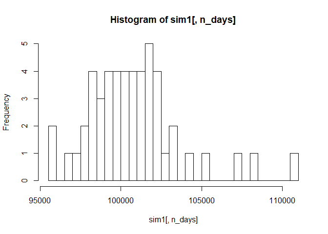

    # Profit/loss
    mean(sim1[,n_days])

    ## [1] 100708.6

    hist(sim1[,n_days]- initial_wealth, breaks=30)
    title("Returns Or Loss",line=5)

    mean(sim1[,n_days] > 100000)

    ## [1] 0.58

    quantile(sim1[,n_days]- initial_wealth,.05)

    ##        5% 
    ## -3127.665

    quantile(sim1[,n_days]- initial_wealth,.01)

    ##        1% 
    ## -4396.297

The mean of capital after 20 trading days is 100708.6 and we can earn an
average rate of return of 0.7% for 20 trading days on our investment. In
addition, we could earn returns at the 58% confidence. Considering the
VaR, if the degree of risk preference and acceptance ability of our
investors is 5%, portfolio 1 has a 5% VaR of 3128, which means that
there is a 0.05 probability that the portfolio 1 will fall in value by
more than 3128 in a 20 trading-day period. If the degree of risk
preference and acceptance ability of our investors is 1%, portfolio 1
has a 1% VaR of 4396, which means that there is a 0.01 probability that
the portfolio 1 will fall in value by more than 4396 in a 20 trading-day
period.

Step2: Portfolio 2 is more aggressive. It contains two kinds of bonds,
which are volitality and leverage bonds. Leverage bonds provide
magnified exposure to popular fixed income benchmarks. They can generage
amplified returns and also have higher risks. Volitality ETFs tend to
move in the opposite direction of the broad market. Therefore, the
portfolio 2 is supposed to win the market and win more when the market
is down. However, it has to cover more risks as well whe nthe market is
up.

    portfolio_2 = c("VIXY", "VIXM", "VIIX","TBT","TMV")
    getSymbols(portfolio_2, from = "2015-01-01") 

    ## [1] "VIXY" "VIXM" "VIIX" "TBT"  "TMV"

    set.seed(9)
    # Adjust for splits and dividends
    VIXYa = adjustOHLC(VIXY)
    VIXMa = adjustOHLC(VIXM)
    VIIXa = adjustOHLC(TBT)
    TMVa = adjustOHLC(TMV)
    TBTa = adjustOHLC(TBT)
    # Look at close-to-close changes
    plot(ClCl(VIXYa))
    title('Close-to-Close Changes for VIXY',line=5)

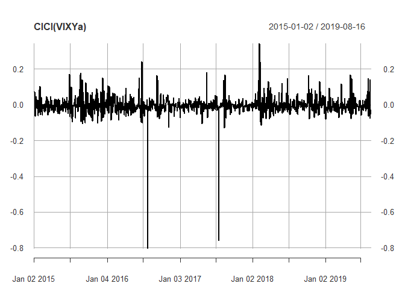

    set.seed(9)
    all_returns_2 = cbind(ClCl(VIXYa),ClCl(VIXMa),ClCl(VIIXa),ClCl(TMVa),ClCl(TBTa))
    head(all_returns_2)

    ##             ClCl.VIXYa   ClCl.VIXMa   ClCl.VIIXa    ClCl.TMVa    ClCl.TBTa
    ## 2015-01-02          NA           NA           NA           NA           NA
    ## 2015-01-05  0.07472098  0.050970476 -0.032548911 -0.047526011 -0.032548911
    ## 2015-01-06  0.02167044  0.004504565 -0.035917298 -0.055023923 -0.035917298
    ## 2015-01-07 -0.03314185 -0.024663706  0.004008536  0.006148282  0.004008536
    ## 2015-01-08 -0.06398537 -0.041226038  0.026303404  0.039180446  0.026303404
    ## 2015-01-09  0.03906250  0.031809494 -0.021052677 -0.032514735 -0.021052677

    all_returns_2 = as.matrix(na.omit(all_returns_2))
    N = nrow(all_returns_2)

    pairs(all_returns_2)
    title('Correlationship between ETFs in portfolio 2',line=5)

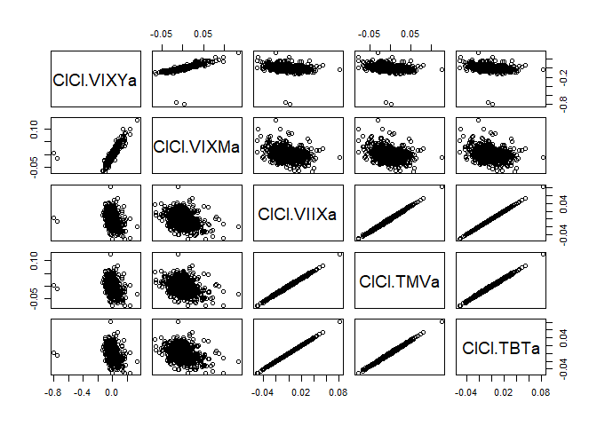

    # Look at the portfolio_2 returns over time
    plot(all_returns_2[,5], type='l')

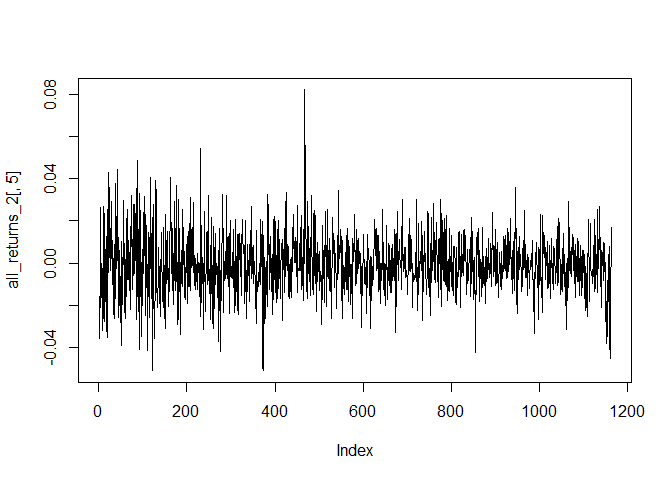

    # are today's returns correlated with tomorrow's? 
    plot(all_returns_2[1:(N-1),5], all_returns_2[2:N,5])
    title("Today's return vs Tomorrow's return for TBT",line=5)

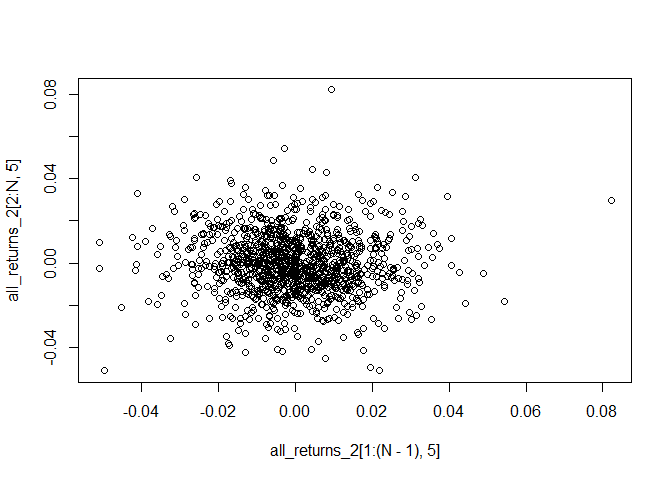

    for(ticker in portfolio_2) {
        expr = paste0(ticker, "a = adjustOHLC(", ticker, ")")
        eval(parse(text=expr))
    }

    head(TBTa)

    ##            TBT.Open TBT.High  TBT.Low TBT.Close TBT.Volume TBT.Adjusted
    ## 2015-01-02 45.35767 45.48539 44.38509  44.66999    3824600     44.66999
    ## 2015-01-05 44.15914 44.19844 43.02937  43.21603    4346400     43.21603
    ## 2015-01-06 42.31222 42.62658 41.10386  41.66383    6139100     41.66383
    ## 2015-01-07 42.26310 42.61676 41.46735  41.83084    3984600     41.83084
    ## 2015-01-08 42.54799 43.08832 42.48905  42.93113    3146300     42.93113
    ## 2015-01-09 43.22585 43.35357 41.99785  42.02732    3673000     42.02732

    set.seed(9)
    # Sample a random return from the empirical joint distribution
    # This simulates a random day
    return.today = resample(all_returns_2, 1, orig.ids=FALSE)

    initial_wealth = 100000
    sim2 = foreach(i=1:50, .combine='rbind') %do% {
        total_wealth = initial_wealth
        weights = c(0.2, 0.2, 0.2, 0.2, 0.2)
        holdings = weights * total_wealth
        n_days = 20
        wealthtracker = rep(0, n_days)
        for(today in 1:n_days) {
            return.today = resample(all_returns_2, 1, orig.ids=FALSE)
            holdings = holdings + holdings*return.today
            total_wealth = sum(holdings)
            wealthtracker[today] = total_wealth
        }
        wealthtracker
    }

    head(sim2)

    ##               [,1]      [,2]      [,3]      [,4]      [,5]      [,6]
    ## result.1 101346.49 101064.89 101515.88 103840.72 103049.64 103950.79
    ## result.2 101051.40 100698.27 100638.91 100492.91 100086.09 100991.75
    ## result.3 100155.12  99365.97  98422.67  98820.36 100975.79  98203.94
    ## result.4 100769.80  99417.54 100824.66  99455.89  98562.47  99602.15
    ## result.5 100114.60 100184.02 100675.24  99832.17  99864.46 100483.78
    ## result.6  98793.98  97600.61  94953.92  94791.00  95911.57  95969.94
    ##               [,7]      [,8]      [,9]     [,10]     [,11]     [,12]
    ## result.1 103782.20 104271.21 106156.89 109072.41 106133.54 107849.74
    ## result.2 102706.01 102332.45  99673.20 104034.04 103557.81 102233.35
    ## result.3  99420.34  99099.04  99810.12 100242.25  99473.00 100336.66
    ## result.4  98081.23  98289.65  98171.10  98783.31  97835.44  99291.71
    ## result.5  99216.91  99955.92  98508.15 101029.15 100606.80 102474.36
    ## result.6  95905.15  95443.67  95196.12  97556.02  95902.96  95144.46
    ##              [,13]     [,14]     [,15]     [,16]     [,17]     [,18]
    ## result.1 108557.19 108337.70 105566.99 105718.64 105669.87 107447.35
    ## result.2 102154.30 102929.67 102452.22 101942.69 102659.51 102506.94
    ## result.3  99359.86  99993.93  99904.45  99515.39  97753.72  97090.86
    ## result.4 100190.29 100864.43  99090.13 100534.27  97873.80  97034.29
    ## result.5 104052.27 103547.40 102012.44 102588.28 101384.47  97290.07
    ## result.6  95167.71  94976.97  94471.63  92384.05  91619.79  90181.49
    ##              [,19]     [,20]
    ## result.1 105843.19 104241.13
    ## result.2 101415.94 102116.54
    ## result.3  97883.10  96991.46
    ## result.4  96498.60  97123.58
    ## result.5  95781.53  95967.55
    ## result.6  90745.55  92052.45

    hist(sim2[,n_days], 25)
    title("Capital Changes for portfolio 2",line=5)

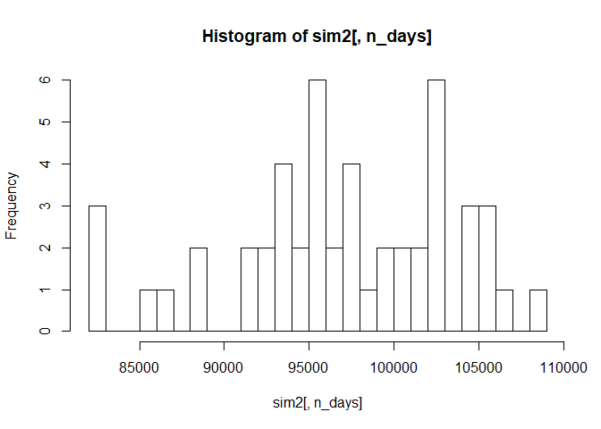

    # Profit/loss
    mean(sim2[,n_days])

    ## [1] 96911.35

    hist(sim2[,n_days]-initial_wealth, breaks=30)
    title("Returns Or Loss",line=5)

    mean(sim2[,n_days] > 100000)

    ## [1] 0.36

    quantile(sim2[,n_days]-initial_wealth,.05)

    ##        5% 
    ## -15993.69

    quantile(sim2[,n_days]-initial_wealth,.01)

    ##        1% 
    ## -17430.46

If we invest portfolio 2, the mean of capital is only 96862 for 20
trading days, which has the 3.1% loss. And there is only 34% probability
to win. For investors at 5% of risk preference, the value in risk is
more than 15539. For investors at 1% of risk preference, the value in
risk is more than 17789. It only earns when the market is down, so we
need to pay close attention to the broad market when investing this
portfolio.

Step3: Finally, we choose a safer portfolio containing 5 government
bonds. Government Bonds ETFs offer investors exposure to fixed income
securities issued by government agencies, which have little risk and
small returns as well. They are more preferred by risk averse
individuals.

    portfolio_3 = c("IEF", "SHY", "BIL","GOVT","SCHO")
    getSymbols(portfolio_3, from = "2015-01-01") 

    ## [1] "IEF"  "SHY"  "BIL"  "GOVT" "SCHO"

    # Adjust for splits and dividends
    IEFa = adjustOHLC(IEF)
    SHYa = adjustOHLC(SHY)
    BILa = adjustOHLC(BIL)
    GOVTa = adjustOHLC(GOVT)
    SCHOa = adjustOHLC(SCHO)
    # Look at close-to-close changes
    plot(ClCl(SCHOa))
    title('Close-to-Close Changes for SCHO',line=5)

    set.seed(99)

    all_returns_3 = cbind(ClCl(IEFa),ClCl(SHYa),ClCl(BILa),ClCl(GOVTa),ClCl(SCHOa))
    head(all_returns_3)

    ##                ClCl.IEFa     ClCl.SHYa     ClCl.BILa   ClCl.GOVTa
    ## 2015-01-02            NA            NA            NA           NA
    ## 2015-01-05  0.0061015771  0.0000000000  0.0002187186  0.001581613
    ## 2015-01-06  0.0067176899  0.0004731606 -0.0002186707  0.004737505
    ## 2015-01-07 -0.0001854031  0.0004729369  0.0000000000  0.000000000
    ## 2015-01-08 -0.0040785596 -0.0001181990  0.0000000000 -0.002357642
    ## 2015-01-09  0.0049329765  0.0008273135  0.0000000000  0.002756991
    ##               ClCl.SCHOa
    ## 2015-01-02            NA
    ## 2015-01-05 -0.0001977259
    ## 2015-01-06  0.0007910799
    ## 2015-01-07  0.0000000000
    ## 2015-01-08  0.0000000000
    ## 2015-01-09  0.0011858103

    all_returns_3 = as.matrix(na.omit(all_returns_3))
    N = nrow(all_returns_3)

    pairs(all_returns_3)
    title('Correlationship between ETFs in portfolio 3',line=5)

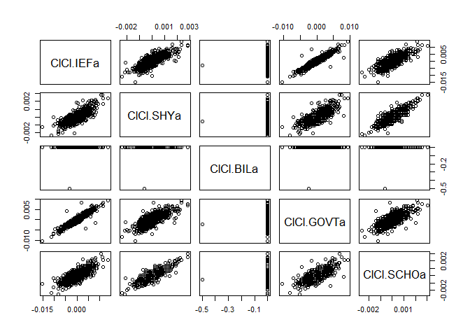

    # all related. Because it is in the same industry
    plot(all_returns_3[,1], type='l')

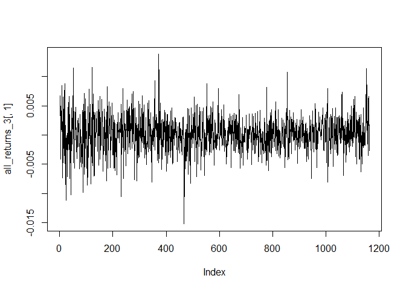

    # Look at the portfolio_3 returns over time
    plot(all_returns_3[,5], type='l')

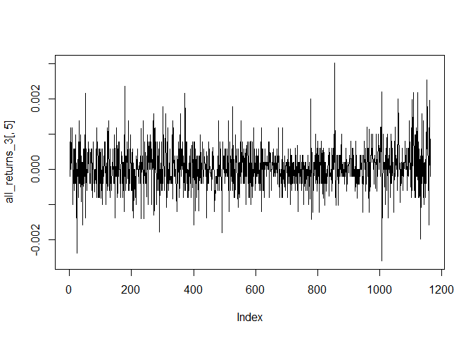

    # are today's returns correlated with tomorrow's? 
    plot(all_returns_1[1:(N-1),5], all_returns_1[2:N,5])
    title("Today's return vs Tomorrow's return for SCHO",line=5)

    for(ticker in portfolio_3) {
        expr = paste0(ticker, "a = adjustOHLC(", ticker, ")")
        eval(parse(text=expr))
    }

    # Sample a random return from the empirical joint distribution
    # This simulates a random day
    set.seed(99)
    return.today = resample(all_returns_3, 1, orig.ids=FALSE)

    initial_wealth = 100000
    sim3 = foreach(i=1:50, .combine='rbind') %do% {
        total_wealth = initial_wealth
        weights = c(0.2, 0.2, 0.2, 0.2, 0.2)
        holdings = weights * total_wealth
        n_days = 20
        wealthtracker = rep(0, n_days)
        for(today in 1:n_days) {
            return.today = resample(all_returns_3, 1, orig.ids=FALSE)
            holdings = holdings + holdings*return.today
            total_wealth = sum(holdings)
            wealthtracker[today] = total_wealth
        }
        wealthtracker
    }

    head(sim3)

    ##               [,1]      [,2]      [,3]      [,4]      [,5]      [,6]
    ## result.1 100082.00 100102.71 100106.25 100596.28 100507.91 100341.38
    ## result.2  99972.25  99934.41  99792.18  99807.74  99643.05  99675.12
    ## result.3 100047.61  99771.94  99683.22  99649.53  99616.72  99620.04
    ## result.4 100147.83 100107.64  99923.48 100099.56 100015.13 100013.94
    ## result.5  99897.01  99929.10 100020.15 100026.59  99751.04  99634.21
    ## result.6  99996.63 100003.70  99963.90  99639.44  99615.89  99789.82
    ##               [,7]      [,8]      [,9]     [,10]     [,11]     [,12]
    ## result.1 100395.93 100316.50 100457.89 100268.13 100153.49 100049.76
    ## result.2  99662.71  99845.41  99699.67  99671.81  99611.81  99643.81
    ## result.3  99577.77  99513.76  99724.12  99716.57  99672.08  99855.58
    ## result.4 100124.59 100031.61 100071.24 100105.06 100096.21  99799.91
    ## result.5  99629.19  99586.82  99721.13  99696.57  99693.00  99596.19
    ## result.6  99824.25  99586.08  99692.94  99492.72  99827.85  99904.26
    ##              [,13]     [,14]     [,15]     [,16]     [,17]     [,18]
    ## result.1 100016.73  99981.88  99816.76  99728.35  99856.64  99815.76
    ## result.2  99615.88  99612.36  99670.01  99570.61  99749.59  99707.16
    ## result.3  99647.57  99607.26  99725.48  99674.10  99693.49  99832.20
    ## result.4 100018.79 100082.67 100060.58  99933.25 100050.56 100042.89
    ## result.5  99548.31  99676.25  99710.76  99652.61  99690.73  99702.48
    ## result.6  99942.58 100003.34 100118.72 100067.05 100204.92 100380.03
    ##              [,19]     [,20]
    ## result.1  99774.92  99808.99
    ## result.2  99894.22  99882.43
    ## result.3  99694.27  99652.79
    ## result.4  99946.53 100069.56
    ## result.5  99685.48  99533.70
    ## result.6 100332.14 100473.24

    hist(sim3[,n_days], 25)
    title("Capital Changes for portfolio 3",line=5)

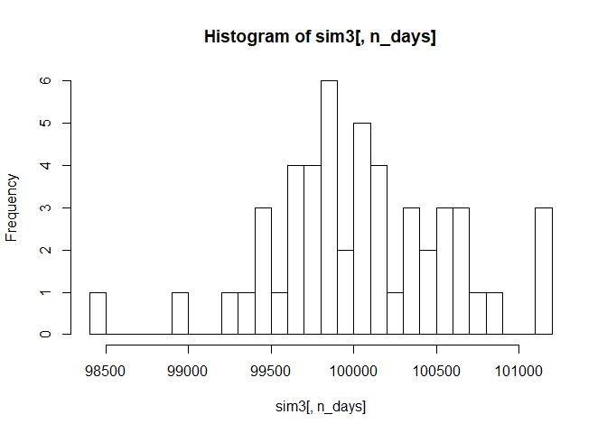

    # Profit/loss
    mean(sim3[,n_days])

    ## [1] 100039.1

    hist(sim3[,n_days]- initial_wealth, breaks=30)
    title("Returns Or Loss",line=5)

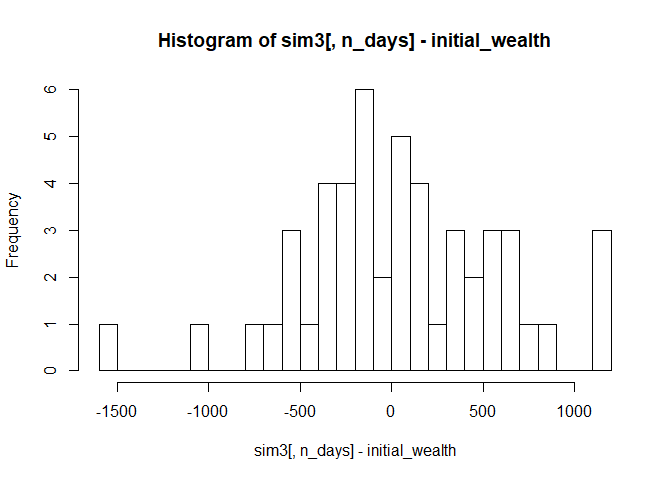

    mean(sim3[,n_days] > 100000)

    ## [1] 0.52

    quantile(sim3[,n_days]- initial_wealth,.05)

    ##        5% 
    ## -690.1049

    quantile(sim3[,n_days]- initial_wealth,.01)

    ##        1% 
    ## -1301.901

From the return and loss histogram, we know that the portfolio 3 is
safer than portfolio 1 and 2, the most loss can only be 1500 and also
the most earns can only less than 1200 approximately which follows the
principle of low risk and low return. Also the correlationship between
ETFs in porfolio 3, they have close relationship between each other
since they are all issued by government agencies and varied
simultaneously. For investors at 1% of risk preference, the value in
risk is more than 1302.

Step4: Combine VaR for three portfolios

    # Combine VaR for three portfolios
    Portfolio_3 <- c(quantile(sim3[,n_days]- initial_wealth,.05), quantile(sim3[,n_days]- initial_wealth,.01))
    Portfolio_2 <- c(quantile(sim2[,n_days]- initial_wealth,.05), quantile(sim2[,n_days]- initial_wealth,.01))
    Portfolio_1<- c(quantile(sim1[,n_days]- initial_wealth,.05), quantile(sim1[,n_days]- initial_wealth,.01))
    VaR <- rbind(Portfolio_1,Portfolio_2,Portfolio_3)
    dimnames(VaR) = list( c("Portfolio 1","Portfolio 2","Portfolio 3"),c("5%","1%"))
    VaR

    ##                      5%         1%
    ## Portfolio 1  -3127.6651  -4396.297
    ## Portfolio 2 -15993.6942 -17430.462
    ## Portfolio 3   -690.1049  -1301.901

    barplot(VaR, beside = TRUE,legend=TRUE,col=c("darkblue","grey","orange"),cex.names=0.8,las=1,bty ="n",args.legend = list(x ='bottom', bty='n', inset=c(-0.25,0)))
    title("VaR For 3 Portfolio at 5% and 1%")

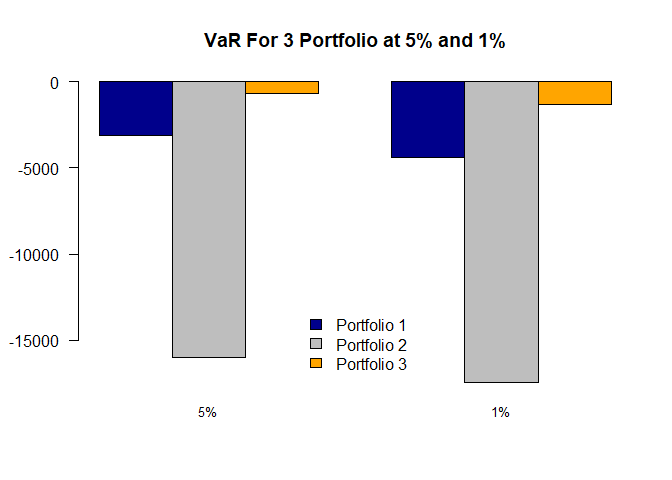

From the VaR at 5% and 1% for these 3 portfolios, we can see that the
porfolio 2 loses most and covers the most risks and the porfolio 1 is
the safest compared with other porfolios. Also, the value at risk is
also different by the lose probability. 1% lose probability will lose
more compared with 5% lose probability. And the probability also
represents the risk preference of investors. If the investors have low
risk preference, it means that we need to consider high lose probability
and the VaR turns out to be less. And we need to choose safer portfolio,
like portfolio 1 or 2, in order to hedge risk as much as possible.

Market segmentation
-------------------

Step 1: Find the correlationship between different interests

    tweet = read.csv("social_marketing.csv", na.strings = '')
    library(tidyverse) 
    library(cluster)   
    library(corrplot)

    ## corrplot 0.84 loaded

    library(ggplot2)
    library(factoextra)

    ## Welcome! Related Books: `Practical Guide To Cluster Analysis in R` at https://goo.gl/13EFCZ

    library(NbClust)
    library(gridExtra)

    ## 
    ## Attaching package: 'gridExtra'

    ## The following object is masked from 'package:dplyr':
    ## 
    ##     combine

    str(tweet)

    ## 'data.frame':    7882 obs. of  37 variables:
    ##  $ X               : Factor w/ 7882 levels "123pxkyqj","12grikctu",..: 3720 2540 4096 596 3197 3609 4749 6518 7418 4917 ...
    ##  $ chatter         : int  2 3 6 1 5 6 1 5 6 5 ...
    ##  $ current_events  : int  0 3 3 5 2 4 2 3 2 2 ...
    ##  $ travel          : int  2 2 4 2 0 2 7 3 0 4 ...
    ##  $ photo_sharing   : int  2 1 3 2 6 7 1 6 1 4 ...
    ##  $ uncategorized   : int  2 1 1 0 1 0 0 1 0 0 ...
    ##  $ tv_film         : int  1 1 5 1 0 1 1 1 0 5 ...
    ##  $ sports_fandom   : int  1 4 0 0 0 1 1 1 0 9 ...
    ##  $ politics        : int  0 1 2 1 2 0 11 0 0 1 ...
    ##  $ food            : int  4 2 1 0 0 2 1 0 2 5 ...
    ##  $ family          : int  1 2 1 1 1 1 0 0 2 4 ...
    ##  $ home_and_garden : int  2 1 1 0 0 1 0 0 1 0 ...
    ##  $ music           : int  0 0 1 0 0 1 0 2 1 1 ...
    ##  $ news            : int  0 0 1 0 0 0 1 0 0 0 ...
    ##  $ online_gaming   : int  0 0 0 0 3 0 0 1 2 1 ...
    ##  $ shopping        : int  1 0 2 0 2 5 1 3 0 0 ...
    ##  $ health_nutrition: int  17 0 0 0 0 0 1 1 22 7 ...
    ##  $ college_uni     : int  0 0 0 1 4 0 1 0 1 4 ...
    ##  $ sports_playing  : int  2 1 0 0 0 0 1 0 0 1 ...
    ##  $ cooking         : int  5 0 2 0 1 0 1 10 5 4 ...
    ##  $ eco             : int  1 0 1 0 0 0 0 0 2 1 ...
    ##  $ computers       : int  1 0 0 0 1 1 1 1 1 2 ...
    ##  $ business        : int  0 1 0 1 0 1 3 0 1 0 ...
    ##  $ outdoors        : int  2 0 0 0 1 0 1 0 3 0 ...
    ##  $ crafts          : int  1 2 2 3 0 0 0 1 0 0 ...
    ##  $ automotive      : int  0 0 0 0 0 1 0 1 0 4 ...
    ##  $ art             : int  0 0 8 2 0 0 1 0 1 0 ...
    ##  $ religion        : int  1 0 0 0 0 0 1 0 0 13 ...
    ##  $ beauty          : int  0 0 1 1 0 0 0 5 5 1 ...
    ##  $ parenting       : int  1 0 0 0 0 0 0 1 0 3 ...
    ##  $ dating          : int  1 1 1 0 0 0 0 0 0 0 ...
    ##  $ school          : int  0 4 0 0 0 0 0 0 1 3 ...
    ##  $ personal_fitness: int  11 0 0 0 0 0 0 0 12 2 ...
    ##  $ fashion         : int  0 0 1 0 0 0 0 4 3 1 ...
    ##  $ small_business  : int  0 0 0 0 1 0 0 0 1 0 ...
    ##  $ spam            : int  0 0 0 0 0 0 0 0 0 0 ...
    ##  $ adult           : int  0 0 0 0 0 0 0 0 0 0 ...

    # see the correlationship between different interests.
    tweet_cor <- cor(tweet[c(2:37)])
    corrplot(tweet_cor,method = 'shade',type = 'upper')

From the corrplot of different interests, we could see that the
following combination has strong relationship 1)online\_gaming and
college\_uni 2)health\_nutrition and personal\_fitness 3)beauty and
fasion 4)cooking and fasion 5)religion and parenting

However, there are some interets thate are not related to any interest,
like ‘uncategorized’, ‘current event’, etc. Therefore, we need to delete
those interest in order to prepare a concise report for NutrientH20. We
delete the following interests: ‘chatter’ , ‘uncategorized’.

Step 2: Pre-processing data

    tweet_new <- tweet[,c(3:5,7:37)]
    tweet_scaled = scale(tweet_new, center=TRUE, scale=TRUE) 
    mu = attr(tweet_scaled,"scaled:center")
    sigma = attr(tweet_scaled,"scaled:scale")

Step 3: See how many clusters should we choose

    set.seed(9)
    clust2 = kmeans(tweet_scaled, 2, nstart=25)
    clus2plot = fviz_cluster(clust2, data = tweet_scaled, 
                             ellipse.type = "euclid", # Concentration ellipse
                             ggtheme = theme_classic(),geom = c("point")
    )
    set.seed(9)
    clust4 = kmeans(tweet_scaled, 4, nstart=25)
    clus4plot = fviz_cluster(clust4, data = tweet_scaled, 
                             ellipse.type = "euclid", # Concentration ellipse
                             ggtheme = theme_classic(),geom = c("point")
    )
    set.seed(9)
    clust6 = kmeans(tweet_scaled, 6, nstart=25)
    clus6plot = fviz_cluster(clust6, data = tweet_scaled, 
                             ellipse.type = "euclid", # Concentration ellipse
                             ggtheme = theme_classic(),geom = c("point")
    )
    set.seed(9)
    clust8 = kmeans(tweet_scaled, 8, nstart=25)
    clus8plot = fviz_cluster(clust8, data = tweet_scaled, 
                             ellipse.type = "euclid", # Concentration ellipse
                             ggtheme = theme_classic(),geom = c("point")
    )

    grid.arrange(clus2plot,clus4plot,clus6plot,clus8plot,ncol = 2,nrow=2)

Compared to different clusters, we should choose 6 clusters which divide
clearer clusters. Then we need to analyze each market and look into each
interest for each cluster.

Step 4: Analyze each cluster

    set.seed(10)
    clust6 = kmeans(tweet_scaled, 6, nstart=25)
    #Choose top 8 interests for each cluster
    cluster1 = sort(clust6$center[1,]*sigma + mu,decreasing = TRUE)[0:8] 
    cluster2 = sort(clust6$center[2,]*sigma + mu,decreasing = TRUE)[0:8] 
    cluster3 = sort(clust6$center[3,]*sigma + mu,decreasing = TRUE)[0:8] 
    cluster4 = sort(clust6$center[4,]*sigma + mu,decreasing = TRUE)[0:8] 
    cluster5 = sort(clust6$center[5,]*sigma + mu,decreasing = TRUE)[0:8] 
    cluster6 = sort(clust6$center[6,]*sigma + mu,decreasing = TRUE)[0:8] 
    par(mfrow=c(3,2))
    barplot(cluster1, col = 'green',las=2, cex.names=1, main= 'Cluster 1')
    barplot(cluster2, col = 'orange',las=2, cex.names=1., main= 'Cluster 2')
    barplot(cluster3, col = 'red', las=2, cex.names=1, main= 'Cluster 3')
    barplot(cluster4, col = 'grey', las=2, cex.names=1,main= 'Cluster 4')
    barplot(cluster5, col = 'blue', las=2, cex.names=1, main= 'Cluster 5')
    barplot(cluster6, col = 'black',las=2, cex.names=1, main= 'Cluster 6')

5 Distinct Markets We cannot conclude a specific group for cluster 3, so
there are 5 interested groups in total for NutrientH20 (skip cluster 3).
From this 5 clusters, we can make the market segment clearly as
following: 1)**Interested in healthy food and cook **\[Cluster 1\] : the
market targets at people who are interested in cooking and focus on
healthy food and personal fitness. They also prefer outdoor activities
and photo sharing, maybe sharing their healthy food pictures.
2)**College Students who like entainment and sports **\[Cluster 2\] :
the market targets at college students, that are mostly interested in
online gaming. The interested group may mostly contain college students.
3)**Photo sharing people **\[Cluster 4\] : the market targets at people
who are used to share their photos and are more concerned about current
events. They may share photos of shopping, travelling and other
interesting life. 4)**Concerned about Politics **\[Cluster 5\] : the
market targets at people who pay close attention to politics, news,
sports, computers and current events. They may contain more middle-aged
males. 5)**Housewife **\[Cluster 6\] : the market targets at people who
love cooking, fashion and beauty. This market is represented by
housewives who are interested in cooking, beauty and shopping.

Author attribution
------------------

    library(tm) 

    ## Loading required package: NLP

    ## 
    ## Attaching package: 'NLP'

    ## The following object is masked from 'package:ggplot2':
    ## 
    ##     annotate

    ## 
    ## Attaching package: 'tm'

    ## The following object is masked from 'package:mosaic':
    ## 
    ##     inspect

    library(naivebayes)

    ## naivebayes 0.9.6 loaded

    library(e1071)
    library(tidyverse)

Step1: First we created reader plain function to help us read the file.
Then read the train and test datasets and create corpus for each sets.

    readerPlain = function(fname){
        readPlain(elem=list(content=readLines(fname)), 
           id=fname, language='en') }

    #read the training data 
    file_train = Sys.glob('ReutersC50/C50train/*/*.txt')
    doc_train = lapply(file_train, readerPlain)

    #read the testing data 
    file_test = Sys.glob('ReutersC50/C50test/*/*.txt')
    doc_test = lapply(file_test, readerPlain)

Step2: Go through each of the data and extract the author names

    mynames = file_train %>%
      { strsplit(., '/', fixed=TRUE) } 

    train_authors= NULL
    for (i in mynames){
      train_authors = c(train_authors, i[3])
    }

    mynames = file_test %>%
      { strsplit(., '/', fixed=TRUE) } 

    test_authors= NULL
    for (i in mynames){
      test_authors = c(test_authors, i[3])
    }

Step3: Create corpus for both data sets, and also make everything to
lowercase. Remove numbers, remove punctuations, remove all white spaces,
and remove all the stop words.

    documents_raw_train = Corpus(VectorSource(doc_train))
    documents_raw_test = Corpus(VectorSource(doc_test))

    my_documents = documents_raw_train
    my_documents = tm_map(my_documents, content_transformer(tolower)) # make everything lowercase

    ## Warning in tm_map.SimpleCorpus(my_documents, content_transformer(tolower)):
    ## transformation drops documents

    my_documents = tm_map(my_documents, content_transformer(removeNumbers)) # remove numbers

    ## Warning in tm_map.SimpleCorpus(my_documents,
    ## content_transformer(removeNumbers)): transformation drops documents

    my_documents = tm_map(my_documents, content_transformer(removePunctuation)) # remove punctuation

    ## Warning in tm_map.SimpleCorpus(my_documents,
    ## content_transformer(removePunctuation)): transformation drops documents

    my_documents = tm_map(my_documents, content_transformer(stripWhitespace)) ## remove excess white-space

    ## Warning in tm_map.SimpleCorpus(my_documents,
    ## content_transformer(stripWhitespace)): transformation drops documents

    my_documents = tm_map(my_documents, content_transformer(removeWords), stopwords("en"))

    ## Warning in tm_map.SimpleCorpus(my_documents,
    ## content_transformer(removeWords), : transformation drops documents

    test_documents = documents_raw_test
    test_documents = tm_map(test_documents, content_transformer(tolower)) # make everything lowercase

    ## Warning in tm_map.SimpleCorpus(test_documents,
    ## content_transformer(tolower)): transformation drops documents

    test_documents = tm_map(test_documents, content_transformer(removeNumbers)) # remove numbers

    ## Warning in tm_map.SimpleCorpus(test_documents,
    ## content_transformer(removeNumbers)): transformation drops documents

    test_documents = tm_map(test_documents, content_transformer(removePunctuation)) # remove punctuation

    ## Warning in tm_map.SimpleCorpus(test_documents,
    ## content_transformer(removePunctuation)): transformation drops documents

    test_documents = tm_map(test_documents, content_transformer(stripWhitespace)) ## remove excess white-space

    ## Warning in tm_map.SimpleCorpus(test_documents,
    ## content_transformer(stripWhitespace)): transformation drops documents

    test_documents = tm_map(test_documents, content_transformer(removeWords), stopwords("en"))

    ## Warning in tm_map.SimpleCorpus(test_documents,
    ## content_transformer(removeWords), : transformation drops documents

Step4: After breifly cleaned the data, we turn it into a matrix. We see
the sparsity is very high, so we decided to remove all elements which
have more then sparse factir of 0.975. We then created matrixs using the
revised data. In addition, we computed the TF-IDF test on both the test
and train and turn it into a matrix.

    DTM_train = DocumentTermMatrix(my_documents)
    DTM_train = removeSparseTerms(DTM_train, 0.975)

    DTM_test = DocumentTermMatrix(test_documents)
    DTM_test = removeSparseTerms(DTM_test, 0.975)

    tfidf_train = weightTfIdf(DTM_train)
    tfidf_test = weightTfIdf(DTM_test)

    nb_train = as.matrix(DTM_train)
    nb_test = as.matrix(DTM_test)

    x_train = as.matrix(tfidf_train)
    x_test = as.matrix(tfidf_test)

Step5: Our data is almost ready at this point, we then combined our
author names and the word counts into one matrix and turned it into
dataframe. We did the same thing again for author names and word count.
One more step we did is to rename the author column for easier access.

    train1 = cbind(x_train,train_authors)
    test1 = cbind(x_test,test_authors) 

    nb_train = cbind(nb_train,train_authors)
    nb_test = cbind(nb_test,test_authors)

    train = as.data.frame(train1)
    names(train)[1601]<-"author_target"
    test = as.data.frame(test1)
    names(test)[1632]<-'author_target'

    nbtrain = as.data.frame(nb_train)
    names(nbtrain)[1601]<-"author_target"
    nbtest = as.data.frame(nb_test)
    names(nbtest)[1632]<-'author_target'

Step6: Our final step is to check for any missing words in the test sets
using intersect function.

    intersection = intersect(names(train),names(test))
    train = train[,intersection]
    test = test[,intersection]

    intersection = intersect(names(nbtrain),names(nbtest))
    nbtrain = nbtrain[,intersection]
    nbtest = nbtest[,intersection]

Step7: After getting our code ready, we decied to perform a random
forest to predict for the correct author. We tried 100,500,1000 trees,
and 50, 80, 100 for m. Using 500 tree and m = 80 give us the best result
without too much compelxity. So our best model accuracy is about 80.48%.

    library(randomForest)

    ## randomForest 4.6-14

    ## Type rfNews() to see new features/changes/bug fixes.

    ## 
    ## Attaching package: 'randomForest'

    ## The following object is masked from 'package:gridExtra':
    ## 
    ##     combine

    ## The following object is masked from 'package:dplyr':
    ## 
    ##     combine

    ## The following object is masked from 'package:ggplot2':
    ## 
    ##     margin

    set.seed(1)
    rf.fit = randomForest(y = factor(train_authors), x = x_train,ntree=500,mtry = 80)
    rf.pred = predict(rf.fit, data=test)
    mean(rf.pred == test$author_target)

    ## [1] 0.8048

Step8: We also tried the naive bayes method to test for accuracy, but we
only got about 69% accuracy.

    nb.fit = naiveBayes(y = factor(train_authors), x = nbtrain)
    nb.pred = predict(nb.fit, newdata = nbtest)
    mean(nb.pred == test$author_target)

    ## [1] 0.688

Overall, Random Forest turns out to be the best model that we did; it
give about 80% accuracy in predicting the right author.

Association Rule Mining
-----------------------

Step1: Read the transaction and look at rules with support &gt; 0.005,
confidence &gt;0.1 & length of the number of items smaller than or equal
to 5. It returns with 1582 rules. The graph shows confidence versus
support and is colored by lift. The rules with high lift are those with
low support. The rules with one or two products have relatively lower
confidence, whereas rules with three or four products have relatively
lower support. However, 1582 rules are to much for us to analyze or get
useful insights.

    library(tidyverse)
    library(arules)  

    ## 
    ## Attaching package: 'arules'

    ## The following object is masked from 'package:tm':
    ## 
    ##     inspect

    ## The following objects are masked from 'package:mosaic':
    ## 
    ##     inspect, lhs, rhs

    ## The following object is masked from 'package:dplyr':
    ## 
    ##     recode

    ## The following objects are masked from 'package:base':
    ## 
    ##     abbreviate, write

    library(arulesViz)

    ## Loading required package: grid

    ## Registered S3 method overwritten by 'seriation':
    ##   method         from 
    ##   reorder.hclust gclus

    groceries= read.transactions("groceries.txt", rm.duplicates=TRUE, format="basket", sep=',')
    groceriesrules = apriori(groceries, 
        parameter=list(support=0.005, confidence=0.1, maxlen=4))

    ## Apriori
    ## 
    ## Parameter specification:
    ##  confidence minval smax arem  aval originalSupport maxtime support minlen
    ##         0.1    0.1    1 none FALSE            TRUE       5   0.005      1
    ##  maxlen target   ext
    ##       4  rules FALSE
    ## 
    ## Algorithmic control:
    ##  filter tree heap memopt load sort verbose
    ##     0.1 TRUE TRUE  FALSE TRUE    2    TRUE
    ## 
    ## Absolute minimum support count: 49 
    ## 
    ## set item appearances ...[0 item(s)] done [0.00s].
    ## set transactions ...[169 item(s), 9835 transaction(s)] done [0.00s].
    ## sorting and recoding items ... [120 item(s)] done [0.00s].
    ## creating transaction tree ... done [0.00s].
    ## checking subsets of size 1 2 3 4

    ## Warning in apriori(groceries, parameter = list(support = 0.005, confidence
    ## = 0.1, : Mining stopped (maxlen reached). Only patterns up to a length of 4
    ## returned!

    ##  done [0.00s].
    ## writing ... [1582 rule(s)] done [0.00s].
    ## creating S4 object  ... done [0.00s].

    plot(groceriesrules)

    ## To reduce overplotting, jitter is added! Use jitter = 0 to prevent jitter.

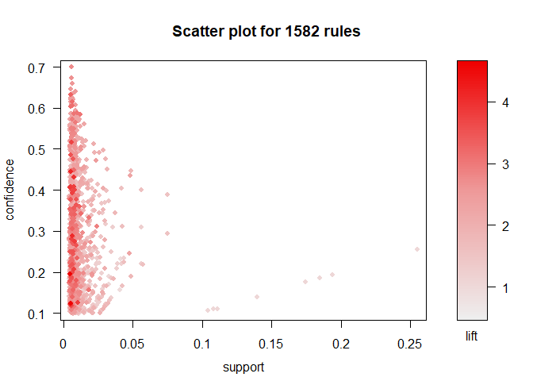

    plot(groceriesrules, method='two-key plot')

    ## To reduce overplotting, jitter is added! Use jitter = 0 to prevent jitter.

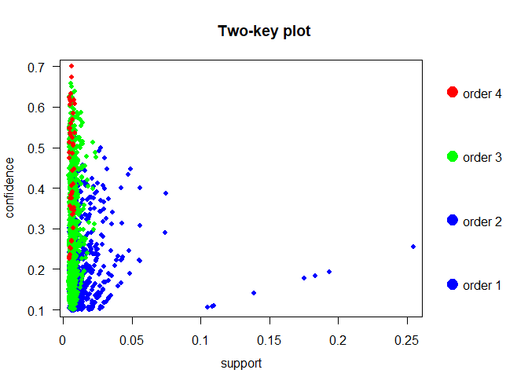

Step2: Reset lift, confidence and support. 1) Set lift greater than 2.2
since the highest lift is around 3. Lift is important to determine if a
certain product is more or less likely to be purchased with other
products than a random draw. 2) Confidence greater than 0.4. Too small
confidence gives us too many rules still. 3) Support greater than 0.01,
meaning at least one out of 100 people buy this porduct. Otherwise the
products are not prevalent enough and leave us too little data for
analysis.

Based on these three measurements, we got 16 rules. Intepretation of
Rule 1 as an example Support = 0.014: 1.4% of transactions contain
“other vegetables”. Confidence: 45% of the transactions that contain
onion also contain “other vegetables”. Lift: 2.37: Customer who bought
“onion” is at least twice more likely to buy “other vegetables” than a
random customer do.

    inspect(subset(groceriesrules, subset=lift > 2.2 & confidence > 0.4 & support > 0.01))

    ##      lhs                     rhs                   support confidence     lift count
    ## [1]  {onions}             => {other vegetables} 0.01423488  0.4590164 2.372268   140
    ## [2]  {root vegetables}    => {other vegetables} 0.04738180  0.4347015 2.246605   466
    ## [3]  {curd,                                                                         
    ##       yogurt}             => {whole milk}       0.01006609  0.5823529 2.279125    99
    ## [4]  {pork,                                                                         
    ##       whole milk}         => {other vegetables} 0.01016777  0.4587156 2.370714   100
    ## [5]  {butter,                                                                       
    ##       other vegetables}   => {whole milk}       0.01148958  0.5736041 2.244885   113
    ## [6]  {whipped/sour cream,                                                           
    ##       yogurt}             => {other vegetables} 0.01016777  0.4901961 2.533410   100
    ## [7]  {whipped/sour cream,                                                           
    ##       whole milk}         => {other vegetables} 0.01464159  0.4542587 2.347679   144
    ## [8]  {pip fruit,                                                                    
    ##       whole milk}         => {other vegetables} 0.01352313  0.4493243 2.322178   133
    ## [9]  {citrus fruit,                                                                 
    ##       root vegetables}    => {other vegetables} 0.01037112  0.5862069 3.029608   102
    ## [10] {citrus fruit,                                                                 
    ##       whole milk}         => {other vegetables} 0.01301474  0.4266667 2.205080   128
    ## [11] {root vegetables,                                                              
    ##       tropical fruit}     => {other vegetables} 0.01230300  0.5845411 3.020999   121
    ## [12] {root vegetables,                                                              
    ##       tropical fruit}     => {whole milk}       0.01199797  0.5700483 2.230969   118
    ## [13] {root vegetables,                                                              
    ##       yogurt}             => {other vegetables} 0.01291307  0.5000000 2.584078   127
    ## [14] {root vegetables,                                                              
    ##       yogurt}             => {whole milk}       0.01453991  0.5629921 2.203354   143
    ## [15] {rolls/buns,                                                                   
    ##       root vegetables}    => {other vegetables} 0.01220132  0.5020921 2.594890   120
    ## [16] {root vegetables,                                                              
    ##       whole milk}         => {other vegetables} 0.02318251  0.4740125 2.449770   228

Step3: Plot the subset of rules by defined measurement in step2.
Customers usually buy citrus fruit, yogurt, tropical fruit, rolls/buns
or domestic eggs together with Whole milk or other vegetables, which
actually make sense because those food are all for daily use. Thus, the
grocery store could consider placing those items together in physical
stores. In addition, the company could provide customized
recommendations/advertisements for online shoppers.

    # graph-based visualization
    sub1 = subset(groceriesrules, subset=lift > 2 & confidence > 0.4 & support > 0.01)
    plot(sub1, method='graph')

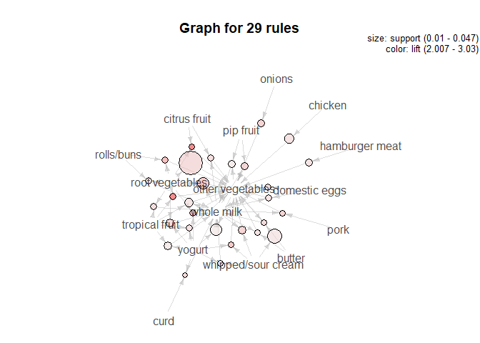
